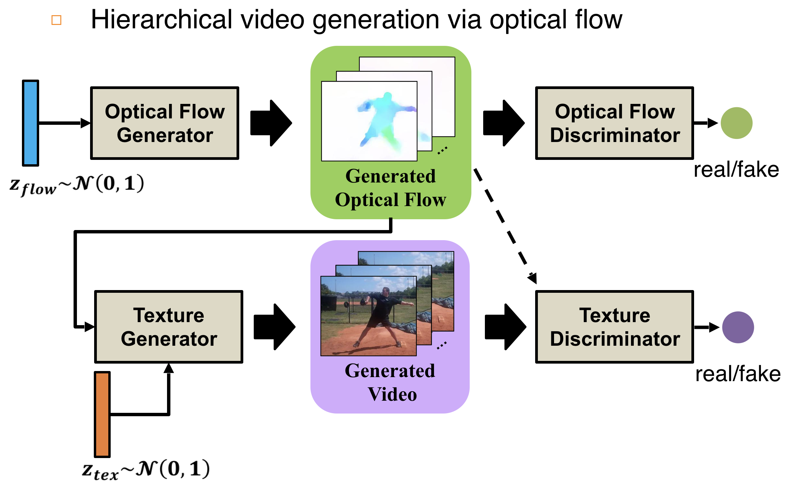
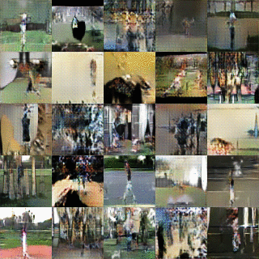
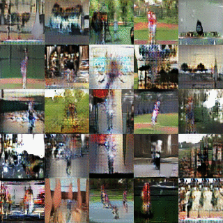

# Flow and Texture GAN (FTGAN)
## Publication
Hierarchical Video Generation from Orthogonal Information: Optical Flow and Texture ([arxiv](https://arxiv.org/pdf/1711.09618.pdf))
[Katsunori Ohnishi](http://katsunoriohnishi.github.io/)\*, Shohei Yamamoto\*, [Yoshitaka Ushiku](http://www.mi.t.u-tokyo.ac.jp/ushiku/), [Tatsuya Harada](http://www.mi.t.u-tokyo.ac.jp/harada/).  
In AAAI, 2018
\* indicates equal contribution.  

## Pipeline
<div style="text-align: center;">

</div>

## Requirements
Python 2.7

[Chainer 3.1.0+](https://github.com/chainer/chainer)

In addition, please `pip install` the following packages:
- `matplotlib`
- `pillow`
- `scipy`

## Demo
You can test FTGAN using pretrained model as follows:
```
cd src/joint_learning
python demo.py --gpu=0
```
If you failed to run because of model loading, please install [git-lfs](https://github.com/git-lfs/git-lfs/wiki/Installation) and run `git lfs clone git@github.com:mil-tokyo/FTGAN.git`, or please download models from [Google Drive](https://drive.google.com/open?id=1elg-Wl57up2yTbJhqb26PlqWLagOLVDg).


## Train
### Preprocess

1. Download the dataset([Penn Action](http://dreamdragon.github.io/PennAction/))and extract optical flow.

2. Resize all frames (76*76) and convert to npy file.

3. Setup dataset directory as follows.<p>

```
    PennAction/
        npy_76/
            0001.npy
            0002.npy
            ...
            2326.npy
        npy_flow_76/
            0001.npy
            0002.npy
            ...
            2326.npy
```


### Train FlowGAN
```
cd src/FlowGAN
python train.py --gpu=0 --root '/path/to/dataset/'
```
### Train TextureGAN
```
cd src/TextureGAN
python train.py --gpu=0 --root '/path/to/dataset/'
```
### Joint learning
```
cd src/joint_learning
python train.py --gpu=0 --root '/path/to/dataset/'
```

### Example of Results

| TextureGAN (from GT Flow and ) |FTGAN (from  and )|
|:-----------|:------------:|
|||


## Citing FTGAN
If you find FTGAN useful in your research, please consider citing:

```
@inproceedings{ohnishi2018ftgan,
  title={Hierarchical Video Generation from Orthogonal Information: Optical Flow and Texture},
  author={Ohnishi, Katsunori and Yamamoto, Shohei and Ushiku, Yoshitaka and Harada, Tatsuya},
  booktitle={AAAI},
  year={2018}
}
```
